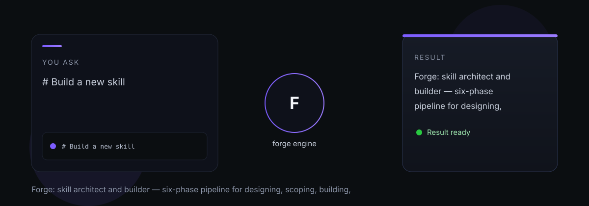

# forge

forge — Forge: skill architect and builder — six-phase pipeline for designing, scoping, building, and validating agent skills.

> Tell it what you need. It does the work.

## What it does

Forge is the only place where new OCAS skills are designed and built. Rather than generating a plan or brief, it runs a mandatory six-phase internal pipeline before writing a single file. Skills are classified by type — shortcut (20-120 lines), workflow (80-250 lines), or system (150-300 lines) — and each type has its own structural expectations. Mentor routes improvement proposals to Forge via journal payloads.

## Dependencies

- [Mentor](https://github.com/indigokarasu/mentor) — receives VariantProposal and VariantDecision files

---

*forge is part of the [OCAS Agent Suite](https://github.com/indigokarasu).*