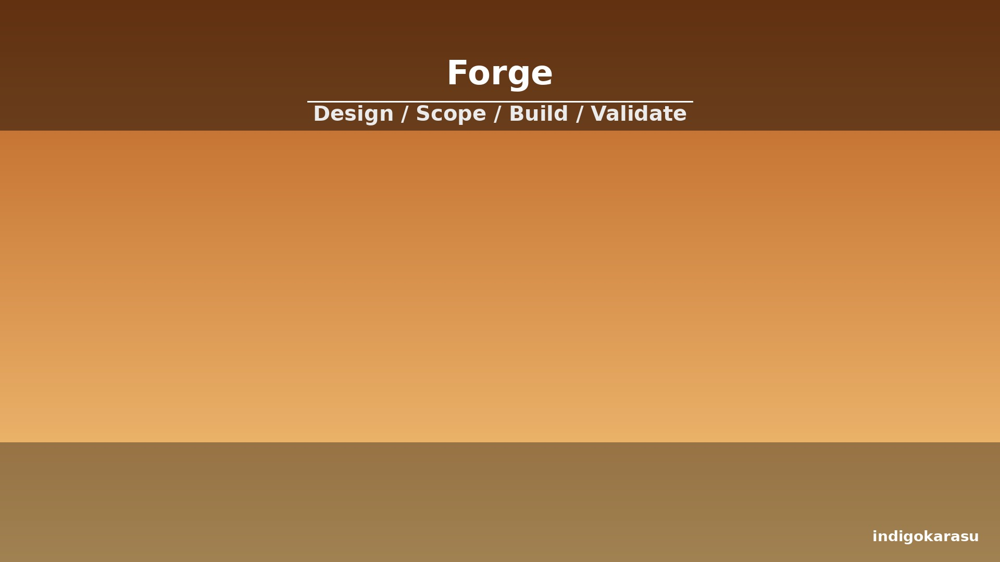

# forge

  

Forge is the design and build pipeline for new OCAS skills. It runs a mandatory six-phase process: scope, structure, author, validate, test, and publish. Skills are classified by size — shortcut (20–120 lines), workflow (80–250 lines), or system (150–300 lines) — and the pipeline enforces the structural rules for each class.

**Capabilities:**
- Six-phase skill construction pipeline
- Size-class enforcement with line budgets
- Reference file generation for SKILL.md, scripts/, and templates
